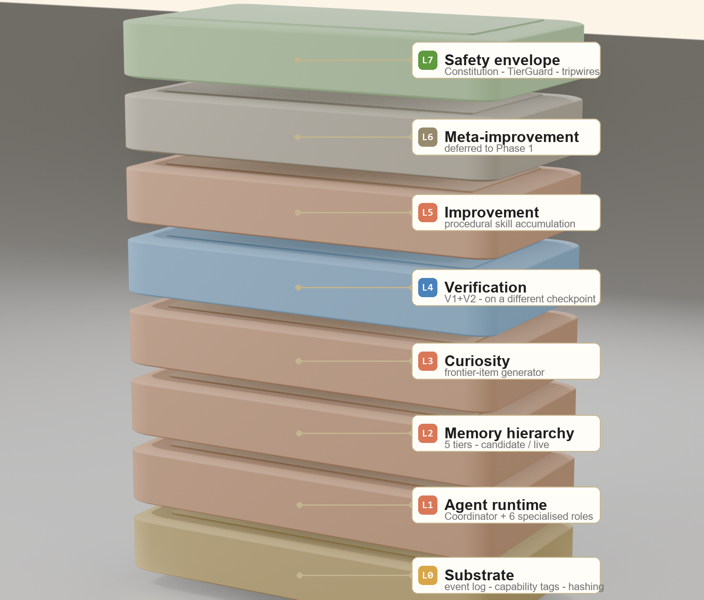
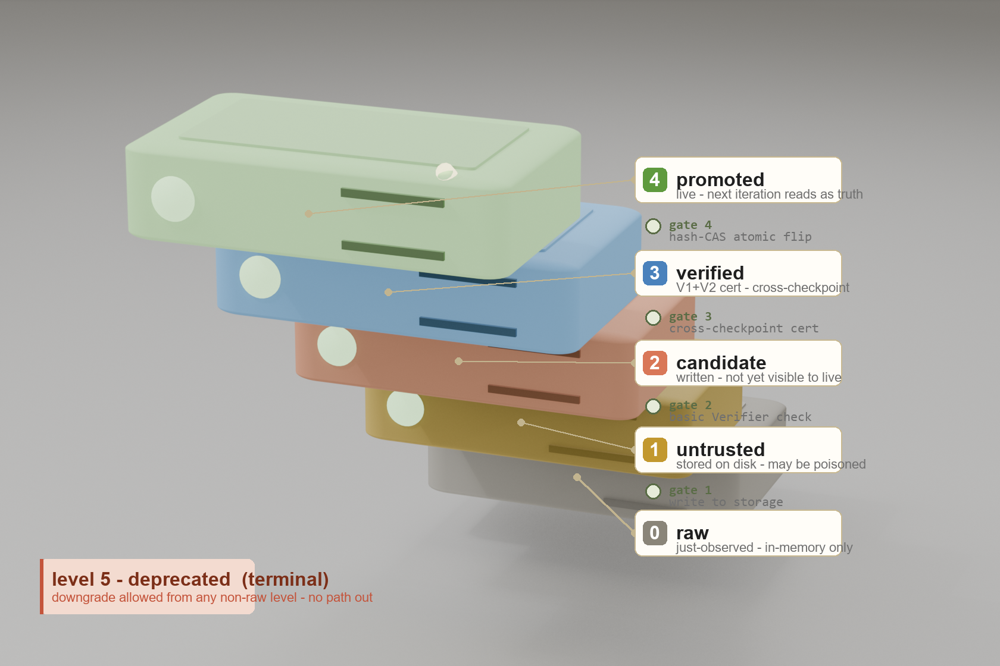
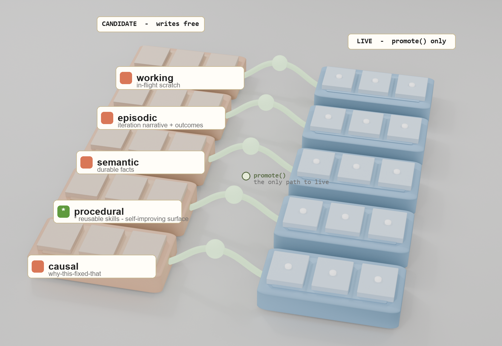

# CSIS · Continuous Self-Improving System

> A coordinator-led multi-agent system designed to run 24/7, maintain persistent memory, and slowly improve itself — **built in public alongside 9 cycles of red-team → fix → regression-test against itself.**

<p align="center">
  
  
  
  
  
  
</p>

## The headline

Most agent-framework repos sell a vision. This one ships a **paper trail of its own failures.**

Across 9 cycles, parallel red-team agents attacked the system, the fixes landed in code with regression tests, and the cycles often found that the *previous* cycle had fixed the bug at the wrong abstraction layer. Two of the bigger lessons:

- **Identity beats timing.** Cycle 8 tried to detect "which iteration wrote this candidate?" with a pre-consolidate snapshot diff. Cycle 9 found the snapshot had a race window. The fix wasn't a wider snapshot — it was a `writer_iteration_id` stamp on each candidate at write time.
- **Chokepoints beat perimeters.** Cycle 8 added a `type(...) is _BackendTracker` check at `Daemon.__init__` to defeat subclass-shaped bypasses of LLM metering. Cycle 9 found three production scripts (`burst.py`, `loop.py`, `demo_pr_scenario.py`) bypassed the Daemon entirely. The fix moved the check into `Coordinator.__init__` — the actual single chokepoint every LLM call passes through.

Full cycle table, finding counts, and architectural-pivot post-mortems live in **[CYCLES.md](CYCLES.md)**.

## What this is

CSIS is the runnable Phase-0 implementation of an architecture proposal for **continuous, self-improving agent systems** on Anthropic's Managed Agents primitives. Instead of episodic agents that wake, work, and forget, run a long-lived organization of specialized roles — Researcher, Builder, Critic, Verifier, Librarian, Auditor — that share persistent memory and improve gradually under load-bearing safety.

The spec lives in [`CSIS-architecture.html`](CSIS-architecture.html). This repo is the prototype.


> **Legend.** Orange-bordered roles (Researcher, Builder, Librarian) run on the **builder checkpoint** — Opus-class. Blue-bordered roles (Verifier, Auditor) run on a **structurally different checkpoint** — Sonnet-class — so the same model that produced the artifact cannot rubber-stamp it. `PROMOTE` is a CAS-style atomic flip; if the live store moved between why-doc signing and promote, the iteration rolls back and nothing reaches live.

**What's working today (Phase 0):**

- The 8-step continuous loop end-to-end on a mock LLM backend (no API key required) or the real Anthropic backend
- 6-level memory trust lattice (`raw` → `untrusted` → `candidate` → `verified` → `promoted` → `deprecated`) with hash-preconditioned promotion as the only mutation primitive
- V1+V2 verification with cross-checkpoint cert signing (Verifier and Auditor on a structurally different checkpoint than the Builder)
- 5-tier memory hierarchy (working / episodic / semantic / procedural / causal) backed by JSON
- Capability-tier substrate — T0/T1 only at Phase-0; T2+ rejected at the call site
- Constitution + tripwires + shutdown token + tier guard, all enforced as code
- 24/7 daemon: curiosity-driven frontier-item generation, budget caps, watchdog, stop file, auto-snapshots
- 3 domain adapters: PR maintenance (any git repo), self-improvement (this repo), Lean formal math (graceful fallback if Lean isn't installed)
- 246 tests passing (4 skipped); every cycle's findings have regression tests, plus the distributional grader stack added after the nine cycles (Dice / IoU / landmark-error / ASSD with bootstrap CIs + per-slice breakdown)

## Evals as a first-class primitive

CSIS treats an **eval** as a composable primitive — the same way an agent platform treats a hook, a tool, or a skill. An eval is an object with a structured result schema (pass/fail semantics, uncertainty, evidence, per-slice breakdown) that plugs into the self-improvement loop in two roles at once: a **gate** that decides whether a proposed change may promote, and a **feedback signal** that tells the next iteration exactly where it is weak.

One primitive, four flavors — the first three are load-bearing in the loop today; adaptive is the natural extension:

| Eval type | Asserts | In CSIS |
|---|---|---|
| **Deterministic** | exact thresholds — unit tests, type checks, diff-scope limits | V1 pinned rubric graders (`passed: bool`) |
| **Semantic** | judgement — LLM critic, reasoning / policy review | V2 falsifying critic, run on a structurally different checkpoint |
| **Distributional** | a number with uncertainty — Dice, landmark error, ASSD, CIs, per-cohort slices | [`distributional_graders.py`](csis/verification/distributional_graders.py) — detailed below |
| **Adaptive** | thresholds that move — tighten as the system improves, vary by risk tier | natural extension; the capability-tier ceiling already gates on oversight maturity |

The loop is the point. The agent proposes a change → runs the evals → gets a **structured result** (not a bare number — slices, confidence intervals, worst-failure modes) → improves the weak slice → and the change only reaches live memory if the eval clears the bar. The eval output *shapes the next step*; it is never just a final report.

That is the idea worth generalizing past this repo: **evals as programmable gates and feedback signals for continuously self-improving agent systems** — a primitive a Managed-Agents-style platform could expose natively, alongside agents, skills, tools, memory, and hooks. The distributional layer below is the most fully-built eval type — the worked example of everything above.

## Distributional graders — outcomes-based evaluation

Most agent-eval frameworks (HealthBench, LLM-Rubric, the CSIS V1 grader set) are **rubric-shaped**: each grader returns `passed: bool`. That's right for PR maintenance, lint pipelines, and CI gates — tasks with discrete acceptance criteria.

It's wrong for tasks whose acceptance criterion is a continuous metric over a sample distribution: medical image segmentation (Dice / IoU / Hausdorff over N cases with per-organ slices), orthopedic reconstruction (ASSD in mm + landmark Euclidean error), calibration (ECE over a held-out set), drug-affinity prediction (Ki / IC50 ± log-units with per-target-family slicing). A `passed: bool` can't carry the CI, the slice breakdown, or the sample size that distribution-level eval needs.

CSIS now ships a **distributional grader layer** alongside the rubric layer:

```python
from csis.verification.distributional_graders import DiceGrader, Sample

grader = DiceGrader(threshold=0.85, n_bootstrap=1000)
result = grader.evaluate([
    Sample(case_id="c-042", payload={"pred_mask": pred, "true_mask": gold},
           slices={"organ": "liver", "modality": "CT"}),
    # ... 522 more cases
])
# result.point_estimate = 0.892
# result.ci_lower / ci_upper = 0.871 / 0.913 (95% bootstrap percentile)
# result.passed = True  (lower CI bound clears the 0.85 threshold)
# result.slices = [organ=liver: 0.94 [0.91, 0.96] PASS,
#                  organ=pancreas: 0.71 [0.66, 0.76] FAIL, ...]
```

Key design choices (full rationale in **[brain/research/02-distributional-graders.md](brain/research/02-distributional-graders.md)**):

- **Conservative pass semantics** — `passed=True` requires the lower CI bound to clear the threshold (for higher-is-better) or the upper bound to stay under (for lower-is-better). A model with mean 0.87 but 95% CI [0.81, 0.93] **fails** against threshold 0.85. The point estimate cleared the bar; the bottom of the CI didn't.
- **Per-slice breakdown** — every sample carries free-form slice labels (organ, modality, cohort, difficulty). The grader emits one `GraderSlice` per `(key, value)` pair with at least `slice_min_n` samples (default 5), each with its own CI and pass flag.
- **Worst-slice critic hook** — `grader.worst_slices(result, k=3)` returns the slices closest to (or past) the threshold so the V2 critic stage attacks where the model is weakest.
- **Pure stdlib** — `random.Random` + `statistics.mean` for the bootstrap; no numpy / scipy dependency. The contract surface is `DistributionalGraderResult`; production users swap in numpy-backed implementations under the same shape.
- **Backward-compatible cert** — `VerifierCertificate` carries both `grader_results` (rubric) and `distributional_results` (distributional). Existing tasks default to empty `distributional_results`; the hash-preconditioned promotion semantics carry through unchanged.

Concrete graders shipped: `DiceGrader`, `IoUGrader`, `LandmarkErrorGrader`, `AssdGrader`. 31 regression tests cover metric correctness, CI shape, pass-rule semantics, slice grouping, and schema round-trip.

**Why this matters past medical imaging:** any agent domain where the right answer to "is the model good?" is *a number with uncertainty* rather than a checkbox needs this shape — coding agents (regression rate over N+30 commits), scientific reasoning (per-protein-family MAE), robotics (per-environment-type success rate). The full case for what Anthropic's Managed Agents could ship to enable this natively is in the research doc.

**Honest Phase-0 deferrals (tracked in [brain/synthesis/01-validation.md](brain/synthesis/01-validation.md)):**

- Real Anthropic Dreams API integration (mocked locally in `csis/dreams/`)
- V3 (debate), V4 (replication), V5 (calibration) verification layers
- I4–I7 improvement layers (DPO, distillation, continued pretraining, NAS)
- Multi-process EventLog (single-process Phase-0 is intentional)
- Sandbox subprocess execution for Builder T1 work (graders read the repo's current state)
- LLM-generated why-doc summaries (templated in Phase 0)
- L6 meta-improvement layer
- Process-level isolation for the wrapped-backend invariant (H2 / H11 deferrals from cycle 9)

## Quick start

```bash
pip install pydantic pytest

# Run the test suite (246 passing).
python -m pytest tests/ -v

# Run one full iteration end-to-end (mock backend, no API key).
python -m csis.loop

# Walk through the 5-scenario PR-maintenance benchmark.
python scripts/demo_pr_scenario.py --clean

# Run the 24/7 daemon (foreground; Ctrl-C to stop).
python -m csis.daemon --backend mock --rate-per-hour 60

# Open the live dashboard (read-only, localhost-only, port 8765 by default).
python -m csis.ui
```

Switching to the real Anthropic backend, running on-demand bursts with a cost ceiling, installing as a Windows service, picking a benchmark domain, and the full operator interface → **[RUN.md](RUN.md)**.

## Live dashboard

```bash
python -m csis.ui                 # opens http://127.0.0.1:8765 in your browser
python -m csis.ui --port 9000     # custom port
python -m csis.ui --no-open       # don't auto-open the browser
python -m csis.ui --host 0.0.0.0  # expose beyond localhost (use with care)
```

Single-page dashboard, polls every 2s, read-only. Shows:

- **Daemon status** — alive / stale, iterations promoted vs rolled back, rollback reason breakdown
- **Cost** — today's spend across every BudgetTracker file, last-hour burn rate, p50/p95 latency, per-model breakdown
- **Memory tiers** — candidate + live counts for each of working / episodic / semantic / procedural / causal
- **Tripwire firings** — last 10 from the event log with labels and surface (frontier / plan / artifact / why_doc)
- **Recent backend calls** — per-call latency, tokens in/out, cost, retry count, outcome — populated from `brain/*.calls.jsonl` sidecars written by every wrapped backend call
- **Event log tail** — newest 20 chain-linked events with seq numbers and actor/kind

The dashboard reads from on-disk artifacts only (event log, budget JSONs, memory store, daemon heartbeat). No coupling to the running daemon — you can boot the dashboard against a stopped state and still see the trail of what happened.

## Architecture

> **Full visual walkthrough** lives at **[https://jim4226.github.io/CSIS/architecture.html](https://jim4226.github.io/CSIS/architecture.html)** — that's the canonical architecture document. It opens with an explicit **threat model** (adversary capability × invariant × layer that catches it), walks through **six diagrams** — an interactive 3D 8-layer stack with click-to-expand layer details, the 6-level trust lattice and 5-tier memory hierarchy as 3D renders, and V1+V2 cross-checkpoint verification, hash-CAS promotion, and sleep/dreams consolidation as flow diagrams — each with a "what fails without this" annotation, and closes with an **observability table** showing how every invariant is actually measured in production. The renders + design rationale below are summary-level so you can read the README on GitHub and still get the shape.

### The 8-layer stack



> Orange layers (L1, L2, L3, L5) are the **builder path** — what does the work. Blue **L4** is the only layer that runs on a **structurally different LLM checkpoint** (Sonnet-class verifying Opus-class). Gold **L0** is the substrate everyone trusts unconditionally. Green **L7** wraps the whole stack and is enforced as code, not as agent-prompt instructions. Dimmed **L6** is the explicit Phase-1 deferral. The stack is also an [interactive 3D scene](https://jim4226.github.io/CSIS/architecture.html#stack) on the architecture page.

### The 6-level trust lattice



> **The only path UP is through a gate.** A level's *elevation* encodes its trust — `raw` sits flat, `promoted` floats highest. Each step is cleared by one structural gate (`write` → `Verifier check` → `cross-checkpoint cert` → `hash-CAS`). Deprecation is always allowed from any non-raw level and is terminal. The lattice is an `IntEnum` so `entry.trust >= TrustLevel.VERIFIED` is a single integer compare in hot paths. Source: [`csis/memory/trust.py`](csis/memory/trust.py).

### The 5-tier memory hierarchy



> Every tier has a **candidate side** (writes free, each entry stamped with the `writer_iteration_id` of whoever wrote it) and a **live side** (read-only). `promote()` is the *only* path from candidate to live — a hash-preconditioned compare-and-swap. `procedural` is the tier where self-improvement actually accumulates. Source: [`csis/memory/store.py`](csis/memory/store.py).

### Code map

| Spec layer | Code |
|---|---|
| L0 — Substrate | [`csis/substrate/`](csis/substrate/) — event log (hash-chained), capability tags, hashing |
| L1 — Agent runtime | [`csis/agents/coordinator.py`](csis/agents/coordinator.py) — the 8-step loop driver |
| L2 — Memory hierarchy | [`csis/memory/`](csis/memory/) — 6 trust levels, 5-tier hierarchy, hash-preconditioned `promote()` |
| L3 — Curiosity & frontier | [`csis/curiosity.py`](csis/curiosity.py) — frontier-item generator |
| L4 — Verification & critic | [`csis/verification/`](csis/verification/) — V1 pinned + distributional graders, V2 critic, cross-checkpoint cert |
| L5 — Improvement (I1–I3) | [`csis/improvement/skill_library.py`](csis/improvement/skill_library.py) — procedural-tier accumulation |
| L6 — Meta-improvement | *deferred to Phase 1 — see [`CSIS-architecture.html`](CSIS-architecture.html) Appendix A* |
| L7 — Safety envelope | [`csis/safety/`](csis/safety/) — constitution, tier guard, tripwires, shutdown |
| Sleep / consolidation | [`csis/dreams/`](csis/dreams/) — mock Dream pipeline + partial-output redaction |
| Live monitoring | [`csis/ui/`](csis/ui/) — stdlib HTTP dashboard with `--allow-control` write actions |

Full per-role tier matrix, cross-checkpoint requirements, and design rationale per layer: **[architecture.html](https://jim4226.github.io/CSIS/architecture.html)**.

## The "brain" auto-save catalog

Every interesting state of the build is snapshotted under [`brain/`](brain/). This folder is durable working memory that lets any future contributor (or a future Claude session) pick up cold.

- [`brain/BRAIN.html`](brain/BRAIN.html) — top-level index, open in a browser
- [`brain/snapshots/`](brain/snapshots/) — 13 point-in-time state files (00-initial → 12-chain-integrity-fix)
- [`brain/plans/`](brain/plans/) — architecture + verification blueprints from planning sub-agents
- [`brain/critiques/`](brain/critiques/) — the red-team critique reports: pre-impl, post-impl, and one per cycle
- [`brain/research/`](brain/research/) — Anthropic SDK research with current API signatures
- [`brain/synthesis/01-validation.md`](brain/synthesis/01-validation.md) — cross-cutting validation that the implementation is coherent

To resume cold: read `brain/BRAIN.html`, then the highest-numbered snapshot, then run the test suite.

## What "improving" means by backend

| Backend | What happens each iteration | Cost |
|---|---|---|
| **Mock** (default) | Architecture exercises itself: curiosity → plan → mock artifact → V1/V2 → promote. Procedural store accumulates. Demonstrates infrastructure survives 24/7. **No real learning.** | $0 |
| **Anthropic** (`--backend anthropic`, requires `ANTHROPIC_API_KEY`) | Real Opus 4.7 (Researcher / Builder / Librarian) + real Sonnet 4.6 (Verifier / Critic / Auditor) calls. Real artifacts, real falsification attempts, real gain accumulation. | ~$0.05–0.15 per iteration. See [`scripts/burst.py`](scripts/burst.py) for finite runs with a hard cost ceiling. |

## Safety properties (load-bearing)

| Property | Implementation | Regression test |
|---|---|---|
| Capability cannot grow faster than oversight | Phase-0 hard ceiling = T1; T2+ rejected at the call site | `test_enforce_rejects_above_phase_0_ceiling_even_if_actor_authorized` |
| Memory mutation is reversible | Candidate stores + `MemoryStore.promote()` is the only path to live | `test_promote_rejects_stale_precondition` |
| Cross-checkpoint verification | `assert_cross_checkpoint` requires ≥2 distinct identity components | `test_cross_checkpoint_requires_two_distinct_components` |
| Grader integrity | Pinned source-hash check at every cert build | `test_pinned_grader_drift_detection` |
| Audit-only structured query | `structured_query()` allow-lists trusted producers only | `test_structured_query_excludes_untrusted_producer` |
| Shutdown enforced at substrate | `ShutdownToken.halt()` raises `HaltSignal` on next iteration | `test_shutdown_blocks_subsequent_checks` |
| Atomic promotion under contention | Single-writer lock + hash-preconditioned CAS | `test_promote_serialization_under_contention` |
| Wrapped-backend invariant (LLM metering can't be bypassed) | `Coordinator.__init__` demands `_BackendTracker`; property setter re-validates on every reassignment | `test_H1_coordinator_rejects_unwrapped_backend` + `test_H3_coordinator_backend_setattr_rejected` |
| TierMismatch cleanup is race-free | `writer_iteration_id` stamp on every candidate at write_candidate time; cleanup filters by stamp | `test_H4_sibling_write_during_consolidate_not_over_discarded` |
| Lost-spend-under-lock-contention | record() appends to WAL on LockUnavailable; next successful record() drains it | `test_H5_record_under_lock_timeout_persists_to_wal` |
| Distributional cert is bound to evidence, not point estimates | `DistributionalGraderResult` carries bootstrap CI + sample size; conservative `passed` rule requires lower-CI-bound clearing the threshold (higher-is-better) or upper bound staying under (lower-is-better) | `test_dice_grader_fails_when_ci_lower_below_threshold`, `test_landmark_grader_fails_when_ci_upper_exceeds_threshold` |
| Event-log hash chain holds across processes | `EventLog.emit()` takes an inter-process file lock and re-reads the file tail under it, so two daemons sharing one `session.jsonl` can't tear the seq chain | `test_event_log_cross_process_serialization` |

246 tests total. Each cycle's findings have a regression test that proves the mitigation works. Full cycle history → **[CYCLES.md](CYCLES.md)**.

## How this was built

Nine cycles, all LLM-driven — red-team reports under [`brain/critiques/`](brain/critiques/), shipped-state snapshots under [`brain/snapshots/`](brain/snapshots/). Cycle-by-cycle breakdown in **[CYCLES.md](CYCLES.md)** — or the visual walkthrough at **[cycles.html](https://jim4226.github.io/CSIS/cycles.html)**.

The pattern that emerged: each cycle, parallel red-team agents attack the prior cycle's fixes; findings are triaged into a critique doc with reproducible attacks and `file:line` evidence; fixes land in code with regression tests; results are snapshotted. Cycles 4-9 each found that the previous cycle's pivot was at the right concept but the wrong abstraction layer, and the next cycle moved it.

## Status

Phase 0. Runnable end-to-end on mock or real Anthropic backend. Architecture-document, critique trail, and 246 passing tests are the proof that's the right framing for "Phase-0 is done."

The system runs 24/7 in mock mode as a structural watchdog. Real-backend learning happens via `scripts/burst.py` on demand. Both paths are documented in [RUN.md](RUN.md).

## License

MIT — see [LICENSE](LICENSE).

## Contact

Open an issue at https://github.com/jim4226/CSIS/issues.
