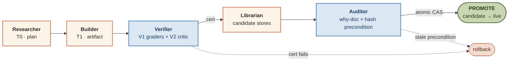

# CSIS · Continuous Self-Improving System

> A coordinator-led multi-agent system designed to run 24/7, maintain persistent memory, and slowly improve itself — **built in public alongside 9 cycles of red-team → fix → regression-test against itself.**

<p align="center">
  
  
  
  
  
  
</p>

## The headline

Most agent-framework repos sell a vision. This one ships a **paper trail of its own failures.**

Across 9 cycles, parallel red-team agents attacked the system, the fixes landed in code with regression tests, and the cycles often found that the *previous* cycle had fixed the bug at the wrong abstraction layer. Two of the bigger lessons:

- **Identity beats timing.** Cycle 8 tried to detect "which iteration wrote this candidate?" with a pre-consolidate snapshot diff. Cycle 9 found the snapshot had a race window. The fix wasn't a wider snapshot — it was a `writer_iteration_id` stamp on each candidate at write time.
- **Chokepoints beat perimeters.** Cycle 8 added a `type(...) is _BackendTracker` check at `Daemon.__init__` to defeat subclass-shaped bypasses of LLM metering. Cycle 9 found three production scripts (`burst.py`, `loop.py`, `demo_pr_scenario.py`) bypassed the Daemon entirely. The fix moved the check into `Coordinator.__init__` — the actual single chokepoint every LLM call passes through.

Full cycle table, finding counts, and architectural-pivot post-mortems live in **[CYCLES.md](CYCLES.md)**.

## What this is

CSIS is the runnable Phase-0 implementation of an architecture proposal for **continuous, self-improving agent systems** on Anthropic's Managed Agents primitives. Instead of episodic agents that wake, work, and forget, run a long-lived organization of specialized roles — Researcher, Builder, Critic, Verifier, Librarian, Auditor — that share persistent memory and improve gradually under load-bearing safety.

The spec lives in [`CSIS-architecture.html`](CSIS-architecture.html). This repo is the prototype.



> **Legend.** Orange-bordered roles (Researcher, Builder, Librarian) run on the **builder checkpoint** — Opus-class. Blue-bordered roles (Verifier, Auditor) run on a **structurally different checkpoint** — Sonnet-class — so the same model that produced the artifact cannot rubber-stamp it. `PROMOTE` is a CAS-style atomic flip; if the live store moved between why-doc signing and promote, the iteration rolls back and nothing reaches live.

**What's working today (Phase 0):**

- The 8-step continuous loop end-to-end on a mock LLM backend (no API key required) or the real Anthropic backend
- 6-level memory trust lattice (`raw` → `untrusted` → `candidate` → `verified` → `promoted` → `deprecated`) with hash-preconditioned promotion as the only mutation primitive
- V1+V2 verification with cross-checkpoint cert signing (Verifier and Auditor on a structurally different checkpoint than the Builder)
- 5-tier memory hierarchy (working / episodic / semantic / procedural / causal) backed by JSON
- Capability-tier substrate — T0/T1 only at Phase-0; T2+ rejected at the call site
- Constitution + tripwires + shutdown token + tier guard, all enforced as code
- 24/7 daemon: curiosity-driven frontier-item generation, budget caps, watchdog, stop file, auto-snapshots
- 3 domain adapters: PR maintenance (any git repo), self-improvement (this repo), Lean formal math (graceful fallback if Lean isn't installed)
- 213 tests; every cycle's findings have regression tests

**Honest Phase-0 deferrals (tracked in [brain/synthesis/01-validation.md](brain/synthesis/01-validation.md)):**

- Real Anthropic Dreams API integration (mocked locally in `csis/dreams/`)
- V3 (debate), V4 (replication), V5 (calibration) verification layers
- I4–I7 improvement layers (DPO, distillation, continued pretraining, NAS)
- Multi-process EventLog (single-process Phase-0 is intentional)
- Sandbox subprocess execution for Builder T1 work (graders read the repo's current state)
- LLM-generated why-doc summaries (templated in Phase 0)
- L6 meta-improvement layer
- Process-level isolation for the wrapped-backend invariant (H2 / H11 deferrals from cycle 9)

## Quick start

```bash
pip install pydantic pytest

# Run the test suite (213 passing).
python -m pytest tests/ -v

# Run one full iteration end-to-end (mock backend, no API key).
python -m csis.loop

# Walk through the 5-scenario PR-maintenance benchmark.
python scripts/demo_pr_scenario.py --clean

# Run the 24/7 daemon (foreground; Ctrl-C to stop).
python -m csis.daemon --backend mock --rate-per-hour 60
```

Switching to the real Anthropic backend, running on-demand bursts with a cost ceiling, installing as a Windows service, picking a benchmark domain, and the full operator interface → **[RUN.md](RUN.md)**.

## Architecture map

| Spec layer (`CSIS-architecture.html`) | Code |
|---|---|
| L0 — Substrate | [`csis/substrate/`](csis/substrate/) — event log (hash-chained), capability tags, hashing |
| L1 — Agent runtime | [`csis/agents/coordinator.py`](csis/agents/coordinator.py) — the 8-step loop driver |
| L2 — Memory hierarchy | [`csis/memory/`](csis/memory/) — 6 trust levels, 5-tier hierarchy, hash-preconditioned `promote()` |
| L3 — Curiosity & frontier | [`csis/curiosity.py`](csis/curiosity.py) — frontier-item generator (seeds + gap-driven + rollback follow-ups) |
| L4 — Verification & critic | [`csis/verification/`](csis/verification/) — V1 pinned graders, V2 critic, cross-checkpoint cert |
| L5 — Improvement (I1–I3) | [`csis/improvement/skill_library.py`](csis/improvement/skill_library.py) — procedural-tier accumulation |
| L6 — Meta-improvement | *deferred to Phase 1* |
| L7 — Safety envelope | [`csis/safety/`](csis/safety/) — constitution, tier guard, tripwires, shutdown |
| Sleep / consolidation | [`csis/dreams/`](csis/dreams/) — mock Dream pipeline + quality scoring + partial-output redaction |

The full eight-layer stack and the per-role tier matrix are in `CSIS-architecture.html` §3 and §5.

## The "brain" auto-save catalog

Every interesting state of the build is snapshotted under [`brain/`](brain/). This folder is durable working memory that lets any future contributor (or a future Claude session) pick up cold.

- [`brain/BRAIN.html`](brain/BRAIN.html) — top-level index, open in a browser
- [`brain/snapshots/`](brain/snapshots/) — 11 point-in-time state files (00-initial → 11-cycle9-shipped)
- [`brain/plans/`](brain/plans/) — architecture + verification blueprints from planning sub-agents
- [`brain/critiques/`](brain/critiques/) — 9 cycles of pre-impl and post-impl red-team reports
- [`brain/research/`](brain/research/) — Anthropic SDK research with current API signatures
- [`brain/synthesis/01-validation.md`](brain/synthesis/01-validation.md) — cross-cutting validation that the implementation is coherent

To resume cold: read `brain/BRAIN.html`, then the highest-numbered snapshot, then run the test suite.

## What "improving" means by backend

| Backend | What happens each iteration | Cost |
|---|---|---|
| **Mock** (default) | Architecture exercises itself: curiosity → plan → mock artifact → V1/V2 → promote. Procedural store accumulates. Demonstrates infrastructure survives 24/7. **No real learning.** | $0 |
| **Anthropic** (`--backend anthropic`, requires `ANTHROPIC_API_KEY`) | Real Opus 4.7 (Researcher / Builder / Librarian) + real Sonnet 4.6 (Verifier / Critic / Auditor) calls. Real artifacts, real falsification attempts, real gain accumulation. | ~$0.05–0.15 per iteration. See [`scripts/burst.py`](scripts/burst.py) for finite runs with a hard cost ceiling. |

## Safety properties (load-bearing)

| Property | Implementation | Regression test |
|---|---|---|
| Capability cannot grow faster than oversight | Phase-0 hard ceiling = T1; T2+ rejected at the call site | `test_enforce_rejects_above_phase_0_ceiling_even_if_actor_authorized` |
| Memory mutation is reversible | Candidate stores + `MemoryStore.promote()` is the only path to live | `test_promote_rejects_stale_precondition` |
| Cross-checkpoint verification | `assert_cross_checkpoint` requires ≥2 distinct identity components | `test_cross_checkpoint_requires_two_distinct_components` |
| Grader integrity | Pinned source-hash check at every cert build | `test_pinned_grader_drift_detection` |
| Audit-only structured query | `structured_query()` allow-lists trusted producers only | `test_structured_query_excludes_untrusted_producer` |
| Shutdown enforced at substrate | `ShutdownToken.halt()` raises `HaltSignal` on next iteration | `test_shutdown_blocks_subsequent_checks` |
| Atomic promotion under contention | Single-writer lock + hash-preconditioned CAS | `test_promote_serialization_under_contention` |
| Wrapped-backend invariant (LLM metering can't be bypassed) | `Coordinator.__init__` demands `_BackendTracker`; property setter re-validates on every reassignment | `test_H1_coordinator_rejects_unwrapped_backend` + `test_H3_coordinator_backend_setattr_rejected` |
| TierMismatch cleanup is race-free | `writer_iteration_id` stamp on every candidate at write_candidate time; cleanup filters by stamp | `test_H4_sibling_write_during_consolidate_not_over_discarded` |
| Lost-spend-under-lock-contention | record() appends to WAL on LockUnavailable; next successful record() drains it | `test_H5_record_under_lock_timeout_persists_to_wal` |

213 tests total. Each cycle's findings have a regression test that proves the mitigation works. Full cycle history → **[CYCLES.md](CYCLES.md)**.

## How this was built

Nine cycles, all LLM-driven, all documented under [`brain/critiques/`](brain/critiques/) and [`brain/snapshots/`](brain/snapshots/). Cycle-by-cycle breakdown in **[CYCLES.md](CYCLES.md)**.

The pattern that emerged: each cycle, parallel red-team agents attack the prior cycle's fixes; findings are triaged into a critique doc with reproducible attacks and `file:line` evidence; fixes land in code with regression tests; results are snapshotted. Cycles 4-9 each found that the previous cycle's pivot was at the right concept but the wrong abstraction layer, and the next cycle moved it.

## Status

Phase 0. Runnable end-to-end on mock or real Anthropic backend. Architecture-document, critique trail, and 213 tests are the proof that's the right framing for "Phase-0 is done."

The system runs 24/7 in mock mode as a structural watchdog. Real-backend learning happens via `scripts/burst.py` on demand. Both paths are documented in [RUN.md](RUN.md).

## License

MIT — see [LICENSE](LICENSE).

## Contact

Open an issue at https://github.com/jim4226/CSIS/issues.
